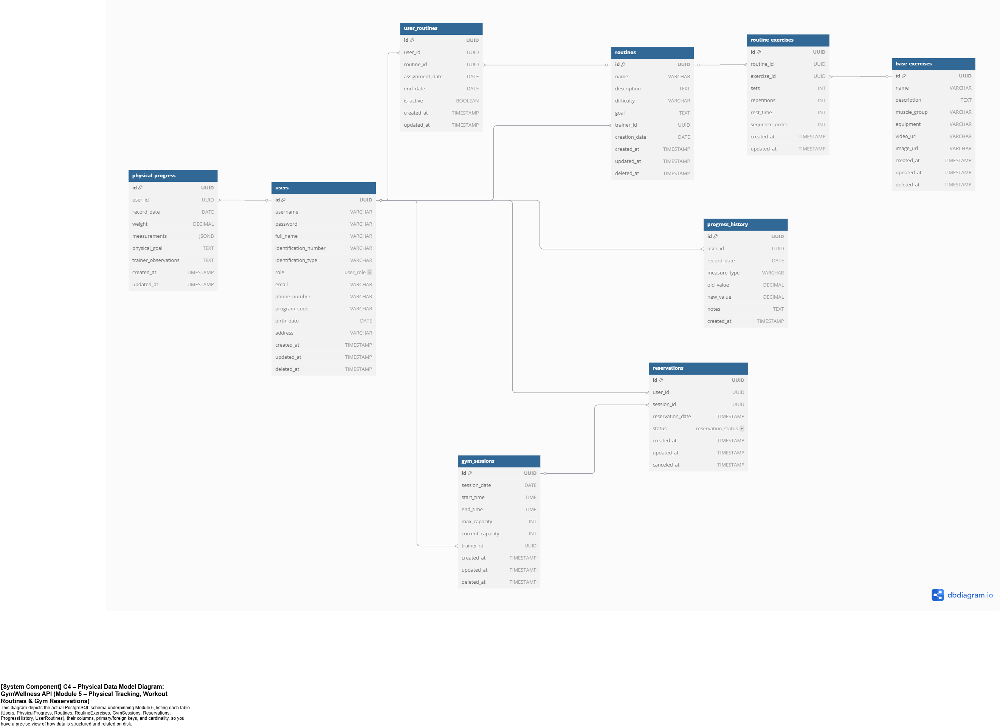

# Prometeo-Back: Smart Gym Management System 🏋️‍♀️


Prometeo-Back is a comprehensive gym management system for the Sports Department at Escuela Colombiana de Ingeniería Julio Garavito. This API provides robust functionality for gym session reservations, equipment management, personalized routines, physical progress tracking, and AI-powered fitness recommendations.

## Table of Contents 📋

- [Team Members](#team-members)
- [Technologies Used](#technologies-used)
- [Architecture](#architecture)
  - [C4 Model](#c4-model)
  - [Component Diagram](#component-diagram)
- [Sprints and Development](#sprints-and-development)
  - [Sprint 1: Core System & DI/IOC](#sprint-1-core-system--diioc)
  - [Sprint 2: CI/CD & Azure Integration](#sprint-2-cicd--azure-integration)
  - [Sprint 3: AI Integration](#sprint-3-ai-integration)
  - [Sprint 4: Security & Performance](#sprint-4-security--performance)
  - [Sprint 5: Frontend Development](#sprint-5-frontend-development)
- [Design Patterns](#design-patterns)
  - [Data Transfer Objects (DTO)](#data-transfer-objects-dto)
  - [Repository Pattern](#repository-pattern)
  - [Service Layer](#service-layer)
- [Project Dependencies](#project-dependencies)
- [Project Configuration](#project-configuration)
- [API Documentation (Swagger)](#api-documentation-swagger)
- [Project Structure](#project-structure)
- [Tests and Coverage](#tests-and-coverage)
- [Contributions](#contributions)

## Team Members

- Andersson David Sánchez Méndez
- Cristian Santiago Pedraza Rodríguez
- Santiago Botero García
- Juan Andrés Rodríguez Peñuela
- Ricardo Andres Ayala Garzon

## Technologies Used 🛠️

- **Java OpenJDK 17**: Main programming language
- **Spring Boot 3.4.5**: Framework for web application development
- **Spring Security**: Security module for authentication and authorization
- **Spring Data JPA**: For integration with PostgreSQL database
- **PostgreSQL on Azure**: Cloud-based relational database
- **OpenAI API**: For AI-powered fitness recommendations
- **HuggingFace API**: For exercise suggestion generation
- **Maven**: Dependency management tool
- **JUnit 5 & Mockito**: Testing frameworks
- **Docker**: Application containerization
- **Azure DevOps**: Agile project management
- **GitHub Actions**: CI/CD pipelines
- **AWS API Gateway**: API management and integration
- **Jacoco**: Code coverage
- **Sonar**: Static code analysis
- **Swagger/OpenAPI**: REST API documentation
- **Lombok**: Boilerplate code reduction
- **Dotenv**: Environment variable management
- **PDFBox & Apache POI**: For document generation and Excel export
- **React & Next.js**: Frontend development with TypeScript

## Architecture 🏗️

The project follows a structured multi-tier architecture:


The architecture is divided into the following layers:

- **Controllers**: Handle HTTP requests and responses
- **Services**: Contain business logic
- **Repositories**: Interfaces for data access
- **Models**: Domain entities and DTOs
- **Configuration**: Spring Boot and security configurations
- **Exception Handling**: Custom error management
- **AI Integration**: OpenAI and HuggingFace clients

### C4 Model

The C4 model provides a clear visualization of the system at different levels of abstraction.

#### Level 1: System Context Diagram


This diagram shows Prometeo as a central system interacting with:

- Gym users (students and staff)
- Sports Department administrators
- External AI systems (OpenAI, HuggingFace)
- Azure PostgreSQL database

#### Level 2: Container Diagram


The container diagram shows the high-level technical components:

- Spring Boot API (Prometeo-Back)
- Azure PostgreSQL Database
- React Frontend (Prometeo-Front)
- AI Services Integration

#### Level 3: Component Diagram


The component diagram details the internal components of the Prometeo-Back API:

- User Management
- Reservation System
- Exercise & Routine Management
- Physical Progress Tracking
- AI Recommendation Engine
- Notification System

#### Level 4: Code Diagram


The component diagram detail the complete code of the Prometeo-Back API:

- Model
- Repository
- Service
- ServiceImpl

#### Level 5: Physical Data Diagram



The physical data model detail the complete DataBase diagram of the Prometeo-Back API:

- Entity Relations
- DBdiagram.io

## Sprints and Development 🏃‍♂️

### Sprint 1: Core System & DI/


#### Objectives Achieved:

- Implementation of Dependency Injection (DI) and Inversion of Control (IoC) using Spring Boot
- Development of the core project structure with layered architecture
- Implementation of data persistence with PostgreSQL on Azure
- Definition of data models: users, routines, gym sessions, equipment, and reservations
- Creation of REST endpoints for CRUD operations on core entities

#### Model Structure:

```java
@Entity
@Table(name = "users")
public class User {
    @Id
    @GeneratedValue(strategy = GenerationType.IDENTITY)
    private Long id;
    
    private String name;
    private String email;
    private String password;
    private boolean isAdmin;
    private boolean isActive;
    
    @OneToMany(mappedBy = "user")
    private List<Routine> routines;
    
    @OneToMany(mappedBy = "user")
    private List<Reservation> reservations;
    
    @OneToMany(mappedBy = "user")
    private List<PhysicalProgress> progressRecords;
    
    // getters and setters
}

@Entity
@Table(name = "routines")
public class Routine {
    @Id
    @GeneratedValue(strategy = GenerationType.IDENTITY)
    private Long id;
    
    private String name;
    private String description;
    private String difficulty;
    
    @ManyToOne
    @JoinColumn(name = "user_id")
    private User user;
    
    @OneToMany(mappedBy = "routine")
    private List<RoutineExercise> exercises;
    
    // getters and setters
}
```

#### Repository Implementation:

```java
@Repository
public interface UserRepository extends JpaRepository<User, Long> {
    User findByEmail(String email);
    List<User> findByIsActiveTrue();
    boolean existsByEmail(String email);
}

@Repository
public interface RoutineRepository extends JpaRepository<Routine, Long> {
    List<Routine> findByUserIdAndIsActiveTrue(Long userId);
    Optional<Routine> findByIdAndUserId(Long id, Long userId);
}
```

#### Service Layer:

```java
@Service
public class UserServiceImpl implements UserService {
    
    private final UserRepository userRepository;
    
    @Autowired
    public UserServiceImpl(UserRepository userRepository) {
        this.userRepository = userRepository;
    }
    
    @Override
    public User findUserById(Long id) {
        return userRepository.findById(id)
            .orElseThrow(() -> new PrometeoExceptions(PrometeoExceptions.USUARIO_NO_ENCONTRADO));
    }
    
    @Override
    public User createUser(User user) {
        if (userRepository.existsByEmail(user.getEmail())) {
            throw new PrometeoExceptions(PrometeoExceptions.YA_EXISTE_USUARIO);
        }
        return userRepository.save(user);
    }
    
    // Additional methods
}
```

### Sprint 2: CI/CD & Azure Integration


#### Objectives Achieved:

- Configuration of GitHub Actions for CI/CD pipeline
- Implementation of unit and integration tests
- Code quality analysis with SonarCloud and Jacoco (89% coverage)
- Automated deployment to Azure App Service
- Configuration of PostgreSQL database in Azure
- Implementation of environment variables (.env) for secure configuration

#### GitHub Actions Workflow:

Two environments were created: test and production.

The CI/CD workflow deploys to the test environment when a PR is made to the develop branch, and to the production environment when merging to the main branch.

```yaml
name: CI/CD Pipeline (Test Environment)

on:
  pull_request:
    branches:
      - develop

jobs:
  build:
    name: Build
    runs-on: ubuntu-latest
    steps:
      - uses: actions/checkout@v4
      - name: Set up JDK 17
        uses: actions/setup-java@v4
        with:
          java-version: '17'
          distribution: 'temurin'
          cache: maven
      - name: Maven Package
        run: mvn clean package -DskipTests
      - name: Upload Artifact
        uses: actions/upload-artifact@v4
        with:
          name: prometeo-app
          path: target/*.jar

  test:
    name: Test
    needs: build
    runs-on: ubuntu-latest
    steps:
      - uses: actions/checkout@v4
      - name: Set up JDK 17
        uses: actions/setup-java@v4
        with:
          java-version: '17'
          distribution: 'temurin'
          cache: maven
      - name: Maven Verify
        run: mvn verify
      - name: SonarCloud Analysis
        env:
          GITHUB_TOKEN: ${{ secrets.GITHUB_TOKEN }}
          SONAR_TOKEN: ${{ secrets.SONAR_TOKEN }}
        run: mvn -B verify org.sonarsource.scanner.maven:sonar-maven-plugin:sonar

  deploy:
    name: Deploy to Test
    needs: test
    runs-on: ubuntu-latest
    steps:
      - name: Download Artifact
        uses: actions/download-artifact@v4
        with:
          name: prometeo-app
      - name: Deploy to Azure Web App (Test)
        uses: azure/webapps-deploy@v2
        with:
          app-name: prometeo-test
          publish-profile: ${{ secrets.AZURE_TEST_PUBLISH_PROFILE }}
          package: '*.jar'
```

#### Database Configuration:

```java
@Configuration
public class DatabaseConfig {

    @Bean
    public DataSource dataSource() {
        Dotenv dotenv = Dotenv.configure().ignoreIfMissing().load();
        
        String host = getValue(dotenv, "NEON_HOST", "localhost:5432");
        String database = getValue(dotenv, "NEON_DATABASE", "postgres");
        String username = getValue(dotenv, "NEON_USERNAME", "postgres");
        String password = getValue(dotenv, "NEON_PASSWORD", "postgres");
        
        String url = "jdbc:postgresql://" + host + "/" + database + "?sslmode=require";
        
        return DataSourceBuilder.create()
                .url(url)
                .username(username)
                .password(password)
                .driverClassName("org.postgresql.Driver")
                .build();
    }
    
    private String getValue(Dotenv dotenv, String key, String defaultValue) {
        String value = dotenv.get(key);
        return (value != null) ? value : defaultValue;
    }
}
```

### Sprint 3: AI Integration


#### Objectives Achieved:

- Integration with OpenAI API for personalized fitness recommendations
- Integration with HuggingFace for exercise suggestion generation
- Implementation of AI-based routine recommendations based on user goals
- Development of progress tracking algorithms
- Creation of dynamic workout plan generation

#### OpenAI Integration:

```java
@Component
public class OpenAiClient {
    private static final Logger logger = LoggerFactory.getLogger(OpenAiClient.class);

    private final WebClient webClient;
    private final ObjectMapper objectMapper;
    private final String apiKey;
    private final String apiUrl;

    public OpenAiClient(WebClient.Builder webClientBuilder, ObjectMapper objectMapper) {
        this.webClient = webClientBuilder.build();
        this.objectMapper = objectMapper;
        
        // Load variables from .env
        Dotenv dotenv = Dotenv.configure().ignoreIfMissing().load();
        this.apiKey = getValue(dotenv, "OPEN_AI_TOKEN", "dummy-key");
        this.apiUrl = getValue(dotenv, "OPEN_AI_MODEL", "https://api.openai.com/v1/chat/completions");
        
        logger.info("OpenAI client initialized with URL: {}", this.apiUrl);
    }
    
    public String generateRoutineRecommendation(Goal userGoal, PhysicalProgress progress) {
        try {
            Map<String, Object> requestBody = new HashMap<>();
            List<Map<String, String>> messages = new ArrayList<>();
            
            // System message to set context
            messages.add(Map.of(
                "role", "system",
                "content", "You are a professional fitness trainer recommending workout routines."
            ));
            
            // User message with goal and current progress
            messages.add(Map.of(
                "role", "user",
                "content", String.format(
                    "Based on my goal of %s and my current measurements (weight: %s kg, height: %s cm), " +
                    "suggest a personalized routine with specific exercises.",
                    userGoal.getDescription(),
                    progress.getWeight(),
                    progress.getHeight()
                )
            ));
            
            requestBody.put("model", "gpt-4");
            requestBody.put("messages", messages);
            
            // API call and response processing
            // ... implementation details
            
            return "Personalized routine recommendation based on your goal";
        } catch (Exception e) {
            logger.error("Error generating routine recommendation", e);
            return "Unable to generate recommendation at this time.";
        }
    }
}
```

#### HuggingFace Integration:

```java
@Service
public class HuggingFaceClient {
    private final HuggingFaceProperties props;
    private final HttpClient httpClient = HttpClient.newHttpClient();

    public HuggingFaceClient(HuggingFaceProperties props) {
        this.props = props;
    }

    public String queryModel(String input) throws Exception {
        String jsonPayload = "{\"inputs\": \"" + input + "\"}";

        HttpRequest request = HttpRequest.newBuilder()
                .uri(URI.create(props.getModelUrl()))
                .header("Authorization", "Bearer " + props.getApiToken())
                .header("Content-Type", "application/json")
                .POST(HttpRequest.BodyPublishers.ofString(jsonPayload, StandardCharsets.UTF_8))
                .build();

        HttpResponse<String> response = httpClient.send(request, HttpResponse.BodyHandlers.ofString());
        
        // Process and return response
        return response.body();
    }
}
```

### Sprint 4: Security & Performance


#### Objectives Achieved:

- Implementation of Spring Security for authentication and authorization
- Password encryption with BCrypt
- Role-based access control (Admin, User)
- JWT implementation for stateless authentication
- Performance optimization with caching and indexes
- Security headers and CORS configuration
- Comprehensive exception handling

#### Security Configuration:

```java
@Configuration
@EnableWebSecurity
public class SecurityConfig {
    
    @Bean
    public SecurityFilterChain filterChain(HttpSecurity http) throws Exception {
        http
            .csrf(csrf -> csrf.disable())
            .authorizeHttpRequests(auth -> auth
                .requestMatchers("/api/auth/**").permitAll()
                .requestMatchers("/api/admin/**").hasRole("ADMIN")
                .anyRequest().authenticated()
            )
            .sessionManagement(session -> session
                .sessionCreationPolicy(SessionCreationPolicy.STATELESS)
            )
            .httpBasic(Customizer.withDefaults());
        
        return http.build();
    }
    
    @Bean
    public PasswordEncoder passwordEncoder() {
        return new BCryptPasswordEncoder();
    }
}
```

#### CORS Configuration and AWS API Gateway Integration:

```java
@Configuration
public class CorsConfig implements WebMvcConfigurer {
    
    @Override
    public void addCorsMappings(CorsRegistry registry) {
        registry.addMapping("/**")
                .allowedOrigins(
                    "http://localhost:3000",
                    "https://prometeo-front.azurewebsites.net",
                    "https://api.prometeo.aws.gateway.com"
                )
                .allowedMethods("GET", "POST", "PUT", "DELETE", "OPTIONS")
                .allowedHeaders("*")
                .allowCredentials(true)
                .maxAge(3600);
    }
}
```

The API is fully integrated with AWS API Gateway, which serves as a central hub for all API endpoints. This configuration facilitates:

- Centralized endpoint management for all microservices
- API versioning and documentation
- Proper CORS configuration across environments
- Traffic management and throttling
- Request validation and transformation

The AWS API Gateway provides a unified interface for frontend applications to connect to our backend services, ensuring consistent security and performance monitoring across all endpoints.

```java
@Configuration
public class ApiGatewayConfig {
    
    @Value("${aws.apigateway.endpoint}")
    private String apiGatewayEndpoint;
    
    @Bean
    public WebClient webClient() {
        return WebClient.builder()
            .baseUrl(apiGatewayEndpoint)
            .defaultHeader(HttpHeaders.CONTENT_TYPE, MediaType.APPLICATION_JSON_VALUE)
            .build();
    }
    
    // Additional AWS API Gateway configuration
}
```

### Sprint 5: Frontend Development


#### Objectives Achieved:

- Development of a modern and responsive UI using React with Next.js (TypeScript)
- Implementation of user-friendly interfaces for gym management
- Integration with backend REST APIs using Axios
- Module organization by functionality:
  - Gym Reservation System
  - Physical Progress Tracking
  - Routine Management
  - Statistical Dashboards
- Utilization of reusable components and Higher-Order Components (HOC)
- Implementation of specialized libraries for gym scheduling and calendar functionality

#### Frontend Tech Stack:

```typescript
// Example of a React component using TypeScript and Axios
import React, { useState, useEffect } from 'react';
import axios from 'axios';
import { Routine } from '../types/routine';
import RoutineCard from '../components/RoutineCard';

const RoutineList: React.FC = () => {
  const [routines, setRoutines] = useState<Routine[]>([]);
  const [loading, setLoading] = useState<boolean>(true);
  
  useEffect(() => {
    const fetchRoutines = async () => {
      try {
        const response = await axios.get<Routine[]>('/api/routines', {
          headers: {
            Authorization: `Bearer ${localStorage.getItem('token')}`
          }
        });
        
        setRoutines(response.data);
        setLoading(false);
      } catch (error) {
        console.error('Error fetching routines:', error);
        setLoading(false);
      }
    };
    
    fetchRoutines();
  }, []);
  
  if (loading) {
    return <div>Loading routines...</div>;
  }
  
  return (
    <div className="routine-list">
      <h2>Your Routines</h2>
      <div className="routine-grid">
        {routines.map(routine => (
          <RoutineCard key={routine.id} routine={routine} />
        ))}
      </div>
    </div>
  );
};

export default RoutineList;
```

The complete frontend codebase, including detailed documentation and component architecture, can be found in the [Olympus repository](https://github.com/DASarria/Olympus.git).

## Design Patterns

### Data Transfer Objects (DTO)

The project utilizes DTOs to separate domain entities from objects used for data transfer between layers and to the frontend:

```java
public class UserDTO {
    private Long id;
    private String name;
    private String email;
    private Boolean isActive;
    private Boolean isAdmin;
    
    // Constructors, getters, and setters
}

public class RoutineDTO {
    private Long id;
    private String name;
    private String description;
    private String difficulty;
    private Long userId;
    private List<RoutineExerciseDTO> exercises;
    
    // Constructors, getters, and setters
}
```

The DTO pattern provides:

- **Security**: Prevents exposing sensitive domain entity details
- **Flexibility**: Allows customized data representation
- **Efficiency**: Transfers only necessary data

### Repository Pattern

The application implements the Repository pattern using Spring Data JPA:

```java
@Repository
public interface ReservationRepository extends JpaRepository<Reservation, Long> {
    List<Reservation> findByUserId(Long userId);
    List<Reservation> findByGymSessionId(Long gymSessionId);
    List<Reservation> findByDateBetween(LocalDate startDate, LocalDate endDate);
}

@Repository
public interface RoutineRepository extends JpaRepository<Routine, Long> {
    List<Routine> findByUserId(Long userId);
    Optional<Routine> findByIdAndUserId(Long id, Long userId);
    List<Routine> findByDifficulty(String difficulty);
}
```

### Service Layer

The Service layer encapsulates business logic between controllers and repositories:

```java
@Service
public class RoutineServiceImpl implements RoutineService {

    private final RoutineRepository routineRepository;
    private final UserRepository userRepository;
    
    @Autowired
    public RoutineServiceImpl(RoutineRepository routineRepository, UserRepository userRepository) {
        this.routineRepository = routineRepository;
        this.userRepository = userRepository;
    }
    
    @Override
    public Routine createRoutine(Routine routine, Long userId) {
        User user = userRepository.findById(userId)
            .orElseThrow(() -> new PrometeoExceptions(PrometeoExceptions.USUARIO_NO_ENCONTRADO));
            
        routine.setUser(user);
        return routineRepository.save(routine);
    }
    
    @Override
    public List<Routine> getRoutinesByUserId(Long userId) {
        return routineRepository.findByUserId(userId);
    }
    
    // Additional methods
}
```

## Project Dependencies

The project uses a variety of dependencies managed by Maven:

```xml
<!-- Spring Boot Core Dependencies -->
<dependency>
    <groupId>org.springframework.boot</groupId>
    <artifactId>spring-boot-starter-data-jpa</artifactId>
</dependency>

<!-- PostgreSQL Database -->
<dependency>
    <groupId>org.postgresql</groupId>
    <artifactId>postgresql</artifactId>
    <scope>runtime</scope>
</dependency>

<!-- Security -->
<dependency>
    <groupId>org.springframework.boot</groupId>
    <artifactId>spring-boot-starter-security</artifactId>
</dependency>

<!-- Web & API -->
<dependency>
    <groupId>org.springframework.boot</groupId>
    <artifactId>spring-boot-starter-web</artifactId>
</dependency>

<!-- AI Integration -->
<dependency>
    <groupId>org.springframework.boot</groupId>
    <artifactId>spring-boot-starter-webflux</artifactId>
</dependency>
<dependency>
    <groupId>com.squareup.okhttp3</groupId>
    <artifactId>okhttp</artifactId>
    <version>4.10.0</version>
</dependency>

<!-- Document Generation -->
<dependency>
    <groupId>org.apache.pdfbox</groupId>
    <artifactId>pdfbox</artifactId>
    <version>2.0.30</version>
</dependency>
<dependency>
    <groupId>org.apache.poi</groupId>
    <artifactId>poi-ooxml</artifactId>
    <version>5.2.3</version>
</dependency>

<!-- Development Tools -->
<dependency>
    <groupId>org.projectlombok</groupId>
    <artifactId>lombok</artifactId>
    <version>1.18.30</version>
    <scope>provided</scope>
</dependency>
<dependency>
    <groupId>io.github.cdimascio</groupId>
    <artifactId>dotenv-java</artifactId>
    <version>3.0.0</version>
</dependency>
```

## Project Configuration

### Prerequisites

- Java OpenJDK 17.x.x
- Apache Maven 3.9.x
- PostgreSQL (local development)
- Azure PostgreSQL (production)
- Docker (optional)

### Environment Variables

The application uses dotenv for secure environment variable management:

```properties
# PostgreSQL Configuration
NEON_HOST=your-azure-postgresql-host.postgres.database.azure.com
NEON_DATABASE=prometeo_db
NEON_USERNAME=admin_user
NEON_PASSWORD=secure_password

# OpenAI Configuration
OPEN_AI_TOKEN=your-openai-api-key
OPEN_AI_MODEL=https://api.openai.com/v1/chat/completions

# HuggingFace Configuration
HUGGINGFACE_API_TOKEN=your-huggingface-api-token
HUGGINGFACE_MODEL_URL=https://api-inference.huggingface.co/models/your-model
```

### application.properties

The main configuration is defined in application.properties:

```properties
spring.application.name=prometeo
# PostgreSQL with Azure configuration
spring.datasource.url=jdbc:postgresql://${NEON_HOST}/${NEON_DATABASE}
spring.datasource.username=${NEON_USERNAME}
spring.datasource.password=${NEON_PASSWORD}
spring.datasource.driver-class-name=org.postgresql.Driver

# JPA configuration
spring.jpa.hibernate.ddl-auto=update
spring.jpa.show-sql=true
spring.jpa.properties.hibernate.format_sql=true
spring.jpa.properties.hibernate.dialect=org.hibernate.dialect.PostgreSQLDialect

# OpenAi configuration
openai.api.key=${OPEN_AI_TOKEN}
openai.api.url=${OPEN_AI_MODEL}

# SSL configuration
spring.datasource.hikari.properties.ssl=true
spring.datasource.hikari.properties.sslfactory=org.postgresql.ssl.NonValidatingFactory

# Server configuration
server.port=8081
```

## API Documentation (Swagger)

The project uses Swagger/OpenAPI for clear API documentation. You can access it at:

```
https://crono-d3evb8a9h2cfd2fb.canadacentral-01.azurewebsites.net/swagger-ui/index.html
```

Example API endpoint documentation:

```java
@RestController
@RequestMapping("/api/users")
@CrossOrigin(origins = "*")
@Tag(name = "User Controller", description = "API for managing user profiles, physical tracking, goals, routines, and reservations")
public class UserController {

    @Autowired
    private UserService userService;

    @Autowired
    private GymReservationService gymReservationService;

    @Autowired
    private RoutineRepository routineRepository;

    @Autowired
    private RoutineExerciseRepository routineExerciseRepository;

    @Autowired
    private BaseExerciseService baseExerciseService;

    @Autowired
    private GoalService goalService;

    @Autowired
    private ReportService reportService;

    // -----------------------------------------------------
    // User profile endpoints
    // -----------------------------------------------------

    @GetMapping("/{id}")
    @Operation(summary = "Get user by ID", description = "Retrieves a user by their unique identifier")
    @ApiResponse(responseCode = "200", description = "User found", content = @Content(schema = @Schema(implementation = User.class)))
    @ApiResponse(responseCode = "404", description = "User not found")
    public ResponseEntity<User> getUserById(@Parameter(description = "User ID") @PathVariable String id) {
        return ResponseEntity.ok(userService.getUserById(id));
    }
    
    // Other endpoints
}
```

## Project Structure

The project follows a clean and organized structure:

```
src
├── main
│   ├── java
│   │   └── edu
│   │       └── eci
│   │           └── cvds
│   │               └── prometeo
│   │                   ├── PrometeoApplication.java
│   │                   ├── PrometeoExceptions.java
│   │                   ├── config
│   │                   │   ├── CorsConfig.java
│   │                   │   ├── DatabaseConfig.java
│   │                   │   ├── OpenAPIConfig.java
│   │                   │   ├── SecurityConfig.java
│   │                   ├── controller
│   │                   │   ├── AuthController.java
│   │                   │   ├── EquipmentController.java
│   │                   │   ├── GymSessionController.java
│   │                   │   ├── PhysicalProgressController.java
│   │                   │   ├── ReservationController.java
│   │                   │   ├── RoutineController.java
│   │                   │   └── UserController.java
│   │                   ├── dto
│   │                   │   ├── BaseExerciseDTO.java
│   │                   │   ├── EquipmentDTO.java
│   │                   │   ├── GoalDTO.java
│   │                   │   ├── GymSessionDTO.java
│   │                   │   ├── PhysicalProgressDTO.java
│   │                   │   ├── ReservationDTO.java
│   │                   │   ├── RoutineDTO.java
│   │                   │   └── UserDTO.java
│   │                   ├── huggingface
│   │                   │   ├── HuggingFaceClient.java
│   │                   │   └── HuggingFaceProperties.java
│   │                   ├── model
│   │                   │   ├── BaseExercise.java
│   │                   │   ├── BodyMeasurements.java
│   │                   │   ├── Equipment.java
│   │                   │   ├── Goal.java
│   │                   │   ├── GymSession.java
│   │                   │   ├── PhysicalProgress.java
│   │                   │   ├── Reservation.java
│   │                   │   ├── Routine.java
│   │                   │   ├── RoutineExercise.java
│   │                   │   ├── User.java
│   │                   │   └── enums
│   │                   ├── openai
│   │                   │   ├── OpenAiClient.java
│   │                   │   └── OpenAiProperties.java
│   │                   ├── repository
│   │                   │   ├── EquipmentRepository.java
│   │                   │   ├── GymSessionRepository.java
│   │                   │   ├── PhysicalProgressRepository.java
│   │                   │   ├── ReservationRepository.java
│   │                   │   ├── RoutineRepository.java
│   │                   │   └── UserRepository.java
│   │                   └── service
│   │                       ├── EquipmentService.java
│   │                       ├── GymSessionService.java
│   │                       ├── PhysicalProgressService.java
│   │                       ├── ReservationService.java
│   │                       ├── RoutineService.java
│   │                       ├── UserService.java
│   │                       └── impl
│   │                           ├── EquipmentServiceImpl.java
│   │                           ├── GymSessionServiceImpl.java
│   │                           ├── PhysicalProgressServiceImpl.java
│   │                           ├── ReservationServiceImpl.java
│   │                           ├── RoutineServiceImpl.java
│   │                           └── UserServiceImpl.java
│   └── resources
│       ├── application.properties
│       └── .env
└── test
    └── java
        └── edu
            └── eci
                └── cvds
                    └── prometeo
                        ├── config
                        ├── controller
                        ├── dto
                        ├── model
                        ├── openai
                        ├── repository
                        └── service
```

## Tests and Coverage


The project has 89% test coverage, validated using Jacoco. The comprehensive test suite includes:

- Unit tests for all service implementations
- Integration tests for controllers and repositories
- Mock tests for external API integrations (OpenAI and HuggingFace)
- Security tests for authentication and authorization

Test reports are automatically generated during CI/CD and analyzed by SonarCloud to ensure code quality and maintenance.

Example test class:

```java
@SpringBootTest
class UserServiceImplTest {

    @MockBean
    private UserRepository userRepository;
    
    @Autowired
    private UserService userService;
    
    @Test
    void findUserByIdShouldReturnUser() {
        // Given
        Long userId = 1L;
        User mockUser = new User();
        mockUser.setId(userId);
        mockUser.setName("Test User");
        
        when(userRepository.findById(userId)).thenReturn(Optional.of(mockUser));
        
        // When
        User foundUser = userService.findUserById(userId);
        
        // Then
        assertNotNull(foundUser);
        assertEquals(userId, foundUser.getId());
        assertEquals("Test User", foundUser.getName());
    }
    
    @Test
    void findUserByIdShouldThrowExceptionWhenUserNotFound() {
        // Given
        Long userId = 999L;
        when(userRepository.findById(userId)).thenReturn(Optional.empty());
        
        // When & Then
        assertThrows(PrometeoExceptions.class, () -> {
            userService.findUserById(userId);
        });
    }
    
    // Additional tests
}
```

## Contributions

This project follows Scrum methodology and CI/CD practices:

1. Developers work in feature branches
2. Pull Requests are required for integrating code into the main branch
3. PRs must pass automated tests and code analysis
4. Code is automatically deployed after successful integration

To contribute:
1. Create a fork of the project
2. Create a branch for your feature (`git checkout -b feature/amazing-feature`)
3. Commit your changes (`git commit -m 'Add some amazing feature'`)
4. Push to the branch (`git push origin feature/amazing-feature`)
5. Open a Pull Request

---

Developed with ❤️ by the Prometeo team
